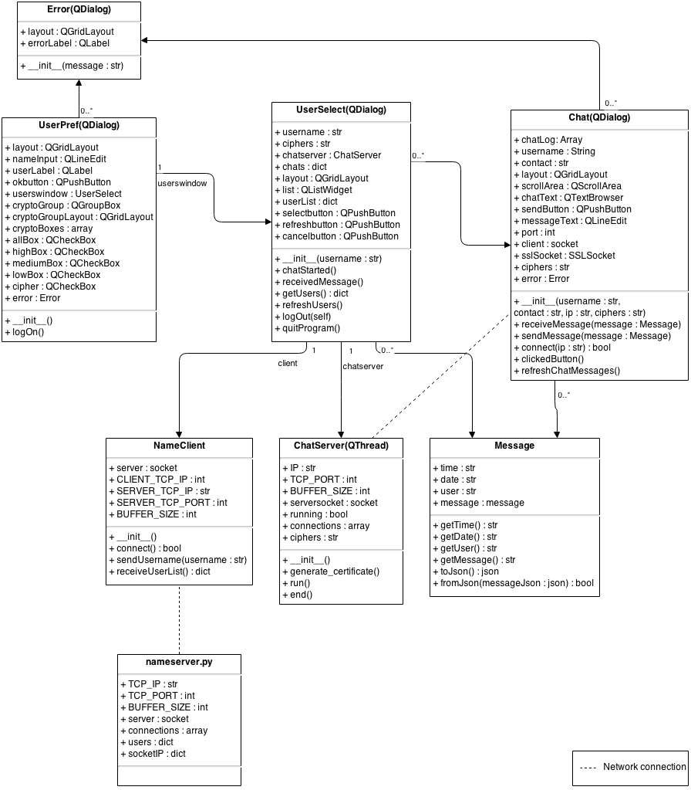
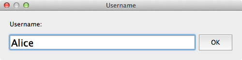
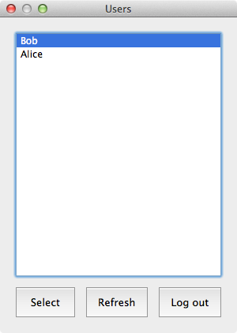

Secure-Chat
===========

The SSL/TLS chat client is a chat client implemented using python and Qt (PyQt). The chat is P2P, but a centralized name-server is used to find other users.

To run the chat client, do the following:
- Run nameserver.py on the server
- Edit the IP in nameclient.py (on the clients) to the IP of the server
- Run main.py on the clients

## Class Diagram

## GUI Elements

#### UserPref

#### UserSelect

#### Chat

